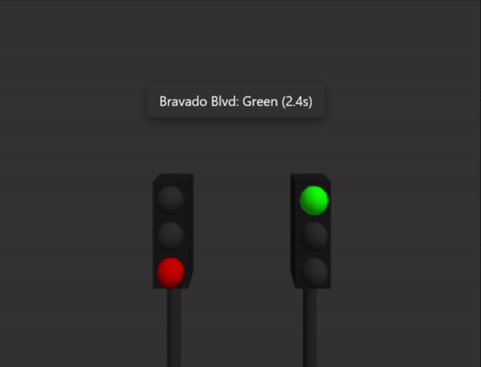
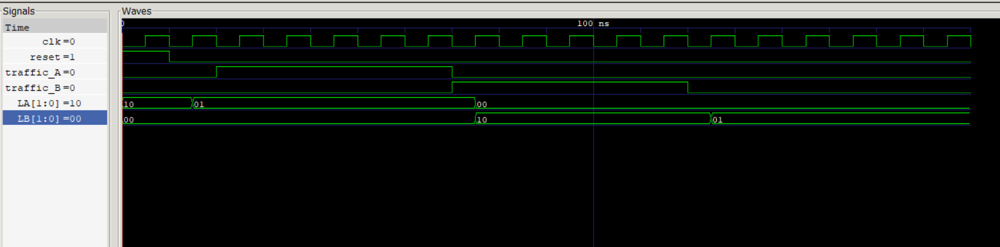

#  Traffic Light Controller Simulation with Verilog 🚦

This project is a simulation of a traffic light controller using **Verilog** for the logic and **Three.js** for the 3D visualization. The traffic light system controls two streets: **Academic Ave** and **Bravado Blvd**, featuring real-time state transitions (green, yellow, and red lights) based on traffic presence. The Verilog module handles the state transitions and timing, while the Three.js visualization provides an interactive 3D representation of the traffic lights, including an overlay to display the current light state with countdown timers.


## Attribution

This project is inspired by concepts from Sara Harris's book "Digital Design and Computer Architecture".


## Demo Video

 

## Table of Contents

- [Traffic Light Controller Simulation with Verilog 🚦](#traffic-light-controller-simulation-with-verilog-)
  - [Attribution](#attribution)
  - [Demo Video](#demo-video)
  - [Table of Contents](#table-of-contents)
  - [Installation](#installation)
  - [Usage](#usage)
  - [Code Explanation](#code-explanation)
    - [TrafficLightController Module :](#trafficlightcontroller-module-)
      - [Module Definition and Inputs/Outputs](#module-definition-and-inputsoutputs)
      - [State Definitions](#state-definitions)
      - [Internal Registers](#internal-registers)
      - [Initial State on Reset](#initial-state-on-reset)
      - [State Transition Logic](#state-transition-logic)
      - [Timer Logic](#timer-logic)
    - [TrafficLightController Testbench](#trafficlightcontroller-testbench)
      - [Timescale and Module Inclusion](#timescale-and-module-inclusion)
      - [Module Definition and Inputs/Outputs](#module-definition-and-inputsoutputs-1)
      - [Instantiate the TrafficLightController Module](#instantiate-the-trafficlightcontroller-module)
      - [Generate Clock Signal](#generate-clock-signal)
      - [Simulation and Logging](#simulation-and-logging)
      - [Initial Settings](#initial-settings)
      - [Scenario 1: Traffic on Academic Ave](#scenario-1-traffic-on-academic-ave)
      - [Scenario 2: Traffic on Bravado Blvd](#scenario-2-traffic-on-bravado-blvd)
      - [Scenario 3: No Traffic](#scenario-3-no-traffic)
      - [End Simulation](#end-simulation)
    - [GTKWave Simulation](#gtkwave-simulation)
      - [Viewing the Simulation](#viewing-the-simulation)
      - [Example Waveform](#example-waveform)
    - [Traffic Light Simulation with Three.js](#traffic-light-simulation-with-threejs)
      - [Initialize Scene, Camera, and Renderer](#initialize-scene-camera-and-renderer)
      - [Orbit Controls for Interactive Camera Movement](#orbit-controls-for-interactive-camera-movement)
      - [Adjust Camera Settings](#adjust-camera-settings)
      - [Handle Window Resizing](#handle-window-resizing)
      - [Add Ambient and Directional Light](#add-ambient-and-directional-light)
      - [Light Colors](#light-colors)
      - [Create Traffic Light with Housing and Pole](#create-traffic-light-with-housing-and-pole)
      - [Initialize Two Traffic Lights](#initialize-two-traffic-lights)
      - [UI Overlay for State Information](#ui-overlay-for-state-information)
      - [State Machine Variables](#state-machine-variables)
      - [Function to Update Traffic Lights and Overlay Text](#function-to-update-traffic-lights-and-overlay-text)
      - [Animation Loop](#animation-loop)


## Installation

To run this project locally:

1. Clone the repository and cd into it :

    ```bash
    cd Lab-Project
    ```

2. Open your browser and go to localhost.

## Usage

After starting the development server, the simulation will automatically run.


## Code Explanation


### TrafficLightController Module :


#### Module Definition and Inputs/Outputs
```verilog
module TrafficLightController(
    input wire clk,
    input wire reset,
    input wire traffic_A,
    input wire traffic_B,
    output reg [1:0] LA,
    output reg [1:0] LB
);
```
- Defines the module and its inputs/outputs.

#### State Definitions
```verilog
parameter S0 = 2'b00;
parameter S1 = 2'b01;
parameter S2 = 2'b10;
parameter S3 = 2'b11;
```
- Defines the states as numerical values.

#### Internal Registers
```verilog
reg [1:0] state, next_state;
integer yellow_timer;
```
- Declares internal registers for the current state, next state, and a timer for yellow light states.

#### Initial State on Reset
```verilog
always @(posedge clk or posedge reset) begin
    if (reset) begin
        state <= S0;
        yellow_timer <= 0;
    end else begin
        state <= next_state;
    end
end
```
- Sets the initial state and resets the timer on reset signal. Otherwise, updates the state to the next state on each clock cycle.

#### State Transition Logic
```verilog
always @(*) begin
    case (state)
        S0: begin
            LA = 2'b10;
            LB = 2'b00;
            if (!traffic_A)
                next_state = S1;
            else
                next_state = S0;
        end
        
        S1: begin
            LA = 2'b01;
            LB = 2'b00;
            if (yellow_timer >= 5)
                next_state = S2;
            else
                next_state = S1;
        end
        
        S2: begin
            LA = 2'b00;
            LB = 2'b10;
            if (!traffic_B)
                next_state = S3;
            else
                next_state = S2;
        end
        
        S3: begin
            LA = 2'b00;
            LB = 2'b01;
            if (yellow_timer >= 5)
                next_state = S0;
            else
                next_state = S3;
        end
        
        default: begin
            next_state = S0;
        end
    endcase
end
```
- Determines the next state and output lights based on the current state and traffic presence.

#### Timer Logic
```verilog
always @(posedge clk or posedge reset) begin
    if (reset) begin
        yellow_timer <= 0;
    end else if (state == S1 || state == S3) begin
        yellow_timer <= yellow_timer + 1;
    end else begin
        yellow_timer <= 0;
    end
end
```
- Resets the timer on reset or when the state is not `S1` or `S3`. Increments the timer on each clock cycle when the state is `S1` or `S3`.


### TrafficLightController Testbench

This Verilog testbench is used to simulate and verify the functionality of the `TrafficLightController` module.

#### Timescale and Module Inclusion
```verilog
`timescale 1ns / 1ps
`include "TrafficLightController.v"
```
- Sets the timescale for the simulation and includes the `TrafficLightController` module.

#### Module Definition and Inputs/Outputs
```verilog
module TrafficLightController_tb();

    reg clk;
    reg reset;
    reg traffic_A;
    reg traffic_B;
    wire [1:0] LA;
    wire [1:0] LB;
```
- Defines the testbench module and its input/output signals.

#### Instantiate the TrafficLightController Module
```verilog
    TrafficLightController UUT (
        .clk(clk),
        .reset(reset),
        .traffic_A(traffic_A),
        .traffic_B(traffic_B),
        .LA(LA),
        .LB(LB)
    );
```
- Instantiates the `TrafficLightController` module and connects the testbench signals to the module's ports.

#### Generate Clock Signal
```verilog
    initial begin
        clk = 0;
        forever #5 clk = ~clk;
    end
```
- Generates a clock signal with a period of 10 nanoseconds.

#### Simulation and Logging
```verilog
    integer file;
    initial begin
        $dumpfile("TrafficLightController_tb.vcd");
        $dumpvars(0, TrafficLightController_tb);

        file = $fopen("traffic_data.csv", "w");
        $fwrite(file, "time,traffic_A,traffic_B,LA,LB\n");
```
- Configures waveform logging for GTKWave and opens a CSV file for writing simulation data.

#### Initial Settings
```verilog
        reset = 1;
        traffic_A = 0;
        traffic_B = 0;
        #10;

        reset = 0;
        #10;
```
- Activates the reset signal and deactivates traffic signals initially. Then deactivates the reset signal after 10 nanoseconds.

#### Scenario 1: Traffic on Academic Ave
```verilog
        traffic_A = 1;
        #50;
        $fwrite(file, "%0d,%0d,%0d,%0d,%0d\n", $time, traffic_A, traffic_B, LA, LB);
```
- Activates traffic on Academic Ave and logs the state after 50 nanoseconds.

#### Scenario 2: Traffic on Bravado Blvd
```verilog
        traffic_A = 0;
        traffic_B = 1;
        #50;
        $fwrite(file, "%0d,%0d,%0d,%0d,%0d\n", $time, traffic_A, traffic_B, LA, LB);
```
- Deactivates traffic on Academic Ave and activates traffic on Bravado Blvd. Logs the state after 50 nanoseconds.

#### Scenario 3: No Traffic
```verilog
        traffic_B = 0;
        #50;
        $fwrite(file, "%0d,%0d,%0d,%0d,%0d\n", $time, traffic_A, traffic_B, LA, LB);
```
- Deactivates traffic on Bravado Blvd and logs the state after 50 nanoseconds.

#### End Simulation
```verilog
        #10 $finish;
        $fclose(file);
    end

endmodule
```
- Ends the simulation after 10 nanoseconds and closes the CSV file.


### GTKWave Simulation

GTKWave is a waveform viewer that can be used to visualize the simulation results of the `TrafficLightController` module. The testbench generates a VCD (Value Change Dump) file that can be opened with GTKWave to analyze the behavior of the traffic light controller over time.

#### Viewing the Simulation

1. Run the simulation to generate the `TrafficLightController_tb.vcd` file.
2. Open GTKWave and load the `TrafficLightController_tb.vcd` file.
3. Add the relevant signals (`clk`, `reset`, `traffic_A`, `traffic_B`, `LA`, `LB`) to the waveform viewer.
4. Analyze the waveforms to verify the correct operation of the traffic light controller.

#### Example Waveform



- The image above shows the GTKWave simulation, where you can see the state transitions and the corresponding traffic light outputs.

By using GTKWave, you can visually inspect the timing and state changes of the traffic light controller, ensuring that it operates as expected under different traffic conditions.


### Traffic Light Simulation with Three.js

This JavaScript code uses the Three.js library to create a 3D simulation of a traffic light system repesnting the verilog code logic.


#### Initialize Scene, Camera, and Renderer
```javascript
const scene = new THREE.Scene();
scene.background = new THREE.Color(0x333333);
const camera = new THREE.PerspectiveCamera(
  75,
  window.innerWidth / window.innerHeight,
  0.1,
  1000
);
const renderer = new THREE.WebGLRenderer({ antialias: true });
renderer.setSize(window.innerWidth, window.innerHeight);
document.body.appendChild(renderer.domElement);
```
- Initializes the scene, camera, and renderer. Sets the background color and appends the renderer to the document body.

#### Orbit Controls for Interactive Camera Movement
```javascript
let controls;
try {
  controls = new THREE.OrbitControls(camera, renderer.domElement);
  controls.enableDamping = true;
} catch (e) {
  console.warn("OrbitControls not found. Skipping camera controls.");
}
```
- Adds OrbitControls for interactive camera movement, with error handling if OrbitControls is not found.

#### Adjust Camera Settings
```javascript
camera.position.set(0, 2, 5);
if (controls) controls.target.set(0, 0, 0);
```
- Sets the camera position and target.

#### Handle Window Resizing
```javascript
window.addEventListener("resize", () => {
  camera.aspect = window.innerWidth / window.innerHeight;
  camera.updateProjectionMatrix();
  renderer.setSize(window.innerWidth, window.innerHeight);
});
```
- Updates the camera and renderer settings when the window is resized.

#### Add Ambient and Directional Light
```javascript
const ambientLight = new THREE.AmbientLight(0x404040, 1.5);
scene.add(ambientLight);
const directionalLight = new THREE.DirectionalLight(0xffffff, 0.5);
directionalLight.position.set(5, 10, 7.5).normalize();
scene.add(directionalLight);
```
- Adds ambient and directional light to the scene.

#### Light Colors
```javascript
const colors = {
  green: 0x00ff00,
  yellow: 0xffff00,
  red: 0xff0000,
  off: 0x333333,
};
```
- Defines the colors for the traffic lights.

#### Create Traffic Light with Housing and Pole
```javascript
function createTrafficLight(x, y, z) {
  const group = new THREE.Group();

  const greenLight = new THREE.Mesh(
    new THREE.SphereGeometry(0.2),
    new THREE.MeshStandardMaterial({ color: colors.off })
  );
  greenLight.position.set(0, 0.5, 0);
  const yellowLight = new THREE.Mesh(
    new THREE.SphereGeometry(0.2),
    new THREE.MeshStandardMaterial({ color: colors.off })
  );
  yellowLight.position.set(0, 0, 0);
  const redLight = new THREE.Mesh(
    new THREE.SphereGeometry(0.2),
    new THREE.MeshStandardMaterial({ color: colors.off })
  );
  redLight.position.set(0, -0.5, 0);

  group.add(greenLight, yellowLight, redLight);

  const housing = new THREE.Mesh(
    new THREE.BoxGeometry(0.5, 1.5, 0.5),
    new THREE.MeshStandardMaterial({ color: 0x222222 })
  );
  housing.position.set(0, 0, -0.3);
  const pole = new THREE.Mesh(
    new THREE.CylinderGeometry(0.1, 0.1, 3),
    new THREE.MeshStandardMaterial({ color: 0x333333 })
  );
  pole.position.set(0, -2, -0.3);
  group.add(housing, pole);

  group.position.set(x, y, z);
  scene.add(group);

  return { greenLight, yellowLight, redLight };
}
```
- Creates a traffic light with housing and pole, and adds it to the scene.

#### Initialize Two Traffic Lights
```javascript
const LA = createTrafficLight(-1, 0, 0);
const LB = createTrafficLight(1, 0, 0);
```
- Initializes two traffic lights at specified positions.

#### UI Overlay for State Information
```javascript
const overlay = document.createElement("div");
overlay.style.position = "fixed";
overlay.style.top = "10px";
overlay.style.left = "10px";
overlay.style.padding = "10px 15px";
overlay.style.backgroundColor = "rgba(50, 50, 50, 0.8)";
overlay.style.color = "white";
overlay.style.fontSize = "16px";
overlay.style.fontFamily = "'Segoe UI', Tahoma, Geneva, Verdana, sans-serif";
overlay.style.borderRadius = "8px";
overlay.style.boxShadow = "0 4px 12px rgba(0, 0, 0, 0.4)";
overlay.style.zIndex = "1000";
overlay.style.transition = "all 0.3s ease";
document.body.appendChild(overlay);
```
- Creates a UI overlay to display state information.

#### State Machine Variables
```javascript
let state = 0;
const yellowDuration = 1.5;
const greenDuration = 2.5;
const clock = new THREE.Clock();
let elapsed = 0;
```
- Defines state machine variables and durations for yellow and green lights.

#### Function to Update Traffic Lights and Overlay Text
```javascript
function updateTrafficLights() {
  LA.greenLight.material.color.set(colors.off);
  LA.yellowLight.material.color.set(colors.off);
  LA.redLight.material.color.set(colors.off);
  LB.greenLight.material.color.set(colors.off);
  LB.yellowLight.material.color.set(colors.off);
  LB.redLight.material.color.set(colors.off);

  let overlayText = "";

  switch (state) {
    case 0:
      LA.greenLight.material.color.set(colors.green);
      LB.redLight.material.color.set(colors.red);
      overlayText = `Academic Ave: Green (${Math.max(
        0,
        greenDuration - elapsed
      ).toFixed(1)}s)`;
      if (elapsed > greenDuration) {
        state = 1;
        elapsed = 0;
      }
      break;

    case 1:
      LA.yellowLight.material.color.set(colors.yellow);
      LB.redLight.material.color.set(colors.red);
      overlayText = `Academic Ave: Yellow (${Math.max(
        0,
        yellowDuration - elapsed
      ).toFixed(1)}s)`;
      if (elapsed > yellowDuration) {
        state = 2;
        elapsed = 0;
      }
      break;

    case 2:
      LA.redLight.material.color.set(colors.red);
      LB.greenLight.material.color.set(colors.green);
      overlayText = `Bravado Blvd: Green (${Math.max(
        0,
        greenDuration - elapsed
      ).toFixed(1)}s)`;
      if (elapsed > greenDuration) {
        state = 3;
        elapsed = 0;
      }
      break;

    case 3:
      LA.redLight.material.color.set(colors.red);
      LB.yellowLight.material.color.set(colors.yellow);
      overlayText = `Bravado Blvd: Yellow (${Math.max(
        0,
        yellowDuration - elapsed
      ).toFixed(1)}s)`;
      if (elapsed > yellowDuration) {
        state = 0;
        elapsed = 0;
      }
      break;
  }
  overlay.innerHTML = overlayText;
}
```
- Updates the traffic lights and overlay text based on the current state and elapsed time.

#### Animation Loop
```javascript
function animate() {
  requestAnimationFrame(animate);
  elapsed += clock.getDelta();
  updateTrafficLights();
  if (controls) controls.update();
  renderer.render(scene, camera);
}
```
- Defines the animation loop to update traffic lights and render the scene.


